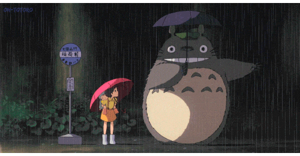
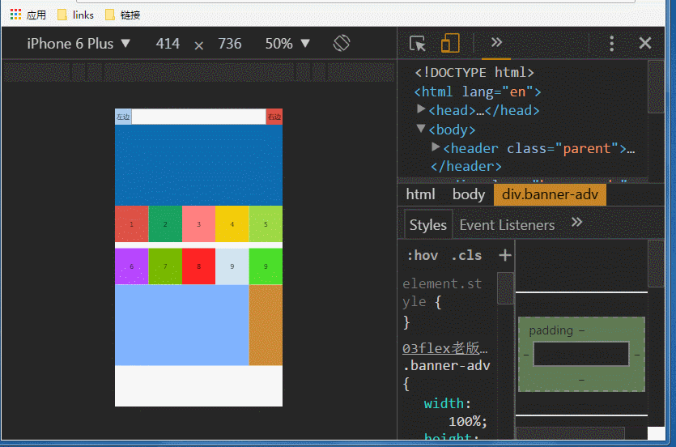
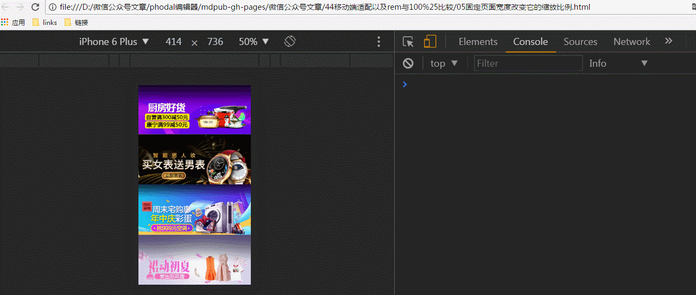
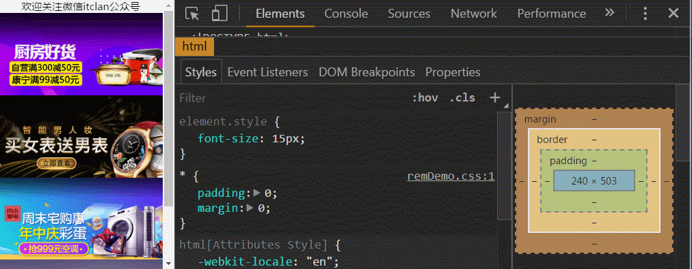
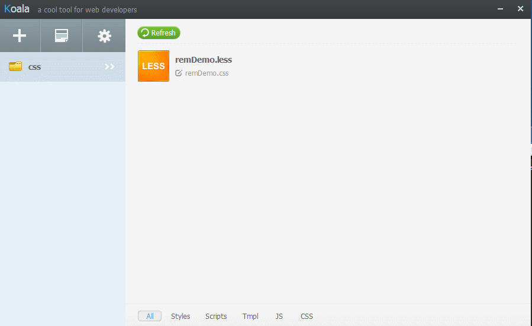

### 移动端适配以及百分比布局与rem比较

点击如下链接,即可收听音频

[移动端适配以及百分比与rem比较](http://m.ximalaya.com/77269469/sound/41911635)

###前言

对于熟悉pc端的小伙伴来说,对于静态页面的布局,一般都是没有什么问题的,为了保持各浏览器显示的一致性,无论是选择优雅降级还是渐进增强,我们有时不得不做兼容性处理,比如css中的hack技术,css3中新增属性添加一些浏览器前缀等,但在移动端对h5新增的属性都比较友好,无需考虑pc端诸多繁琐的兼容性问题,但这并不意味不存在兼容性问题,因为移动设备很多(ios,android等),各设备分辨率不一致,那么同样为保持在各个设备上显示一致性,我们必须得进行适配处理,对于接触得少移动端的童鞋来说,往往从设计师那拿到psd文档,如果依然按照pc端的处理方式,绝对是走不通的,有时却不知如何下手,往往处理得不是很好,一听到什么rem适配,100%布局,对于熟悉使用固定像素值的方式的童鞋来说,刚开始内心是焦虑的,对于如何选择什么样的方式很好的进行页面布局实现内容结构良好的展现,非常苦恼,而在页面交互上,元素触发事件等与pc端也有很大的不同,对于移动端的学习,我也一直在学习当中,今天给大家分享一下自己的学习心得,把自己曾学过的东西进行总结梳理了一下,本篇并不涉及到什么高大上的内容,初学者笔记学习心得,如果您是老司机,可以选择上车也可以下车,欢迎路过的老师多提意见和指正.

>### pc端网站与移动端(手机)网站区别


`PC端`:屏幕尺寸大,显示内容多,结构复杂,缩小浏览器窗口,页面内容结构并不会发生改变,也并不是响应式
`移动端(手机网站)`:屏幕尺寸小,显示的内容有限,结构清晰,简洁,设备类型(ipad,iphone5,6,安卓等)繁多,页面内容结构自适应变化,随着浏览器窗口缩小而缩小,放大而放大,等比例缩放
`相同点`:利用html+css(包括css3)+javascript,pc端性能优化同样适用于移动端策略
`不同点`:
* 移动端的网络速度手机用户大多是通过2G,3G,4G网络来上网,网络速度远低于大部分PC常用的有线网络的,所以移动端网页如果过大,加载时间就会越长,会增加网页访问的跳出率,对于移动端来说,所有的加载速度必须在1秒之内,所以移动端的性能优化必须要考虑的问题,包括图片加载,文件大小等,具体性能优化,可参考往期,`不可不知的前端性能优化`文章
* PC端上,页面的交互都是鼠标点击,滚轮等操作,而在手机上,都是手指触屏,滑屏操作,页面元素上的按钮,链接等也要大小适中,适合手指点击,在事件处理上也有很大的区别
* PC端兼容性繁多(三个祖中ie678得供着),而移动端无需考虑,更新快,对h5新增的属性,兼容性都很好,顶多加上webkit内核前缀,但是这并不意味着在各个手机浏览器显示相同,什么UC,QQ浏览器仍然是需要特殊兼容性处理的
* pc端,页面布局,设计稿多大,基本上按照psd文档,按照1:1切图,固定宽度,高度,图片已切出来的实际尺寸大小进行填充即可,但是在移动端上,则不行,手机端的分辨率比较高,至于这个分辨率(它指的是显示屏横纵能够容纳的像素点,比如1366x768)表示的是横向能容纳1366个像素点,而纵向能容纳768个像素点,分辨率越高,像素点越多,图片就越清晰
*  在pc端,1px像素和浏览器端的像素可以一一对应,按照设计师给出的psd文档按照1:1的方式来做就行了,ps软件中,量出多大的尺寸,对应的css里面就设置多少像素,而在移动端,设备屏幕尺寸比较小,分辨率比较大,比如提高分辨率原先320到640的或者750,960的，提高到两倍，三倍，但是提高之后,css的像素还是依然没有改变,在pc端是一个像素,而到移动端,可能就是两像素,三像素,所以一般针对移动端的设计稿,常见的做法事,从设计稿量中量出来的尺寸,切出来图,在实际给元素设置尺寸时,都应对应的减半(2:1,或者3:1)的方式进行设置尺寸(比如设计稿是960,750,640的的图,那么减半就是320,375,320的),页面中字体,图片对应减半设置即可
*    新的API,获取元素的方法,比如document.querySelector(),document.querySelectorAll(),虽然在性能上不如旧的选择器,但是用着方便,一些移动端框架用该选择器比较多,比如jQuery Mobile，sui Mobile,mui等
*  pc端的事件不适合在移动端用,比如click(会有300毫秒延迟),移动端上用ontouchstart(手指按下),ontouchmove(手指移动),ontouchend,但是注意的是在Google模拟器下使用on的方式添加touch事件会无效,具体怎么解决这种问题,可以通过addEventListener()的绑定方式,注意用此方法监听事件时,就不要带on,具体见下代码所示
* 针对移动端一像素偏差问题,与像素比有关系,也就是所谓的物理像素(分辨率)与独立像素(屏幕的宽度),pc端一像素就是一像素,但是在移动端1像素,有时就不是一像素,也许是两像素,三像素的
   * 通过添加伪类的方式,同时改变transform:scale(0.5),缩小为一半
   * 设置div宽度为1像素,同时设置IE怪异盒模型,box-sizing:border-box
   * 一像素的背景图片替代

* 手机网站不适合用作响应式,比如:bootstrap等,因为它很重,不轻量,在pc端网络带宽下加载还是可以的,但是在移动端,就很耗性能来,耗流量,耗电..太过于臃肿,而影响网页的加载
* 布局方面,移动端,少用浮动,会破坏文档流,不易拓展,多用Flex布局,移动端上Ie怪异盒模型也是很常用,对于改变元素位置,通常用translate,而不用定位,改变left,top值
* PC端上,用固定像素值px作为元素设置尺寸单位,而在移动端,通常用rem(root 根节点根据html的字体大小计算其他元素尺寸),或者100%,
* ...

>### 为什么要做适配

* 为了适应各个移动终端设备屏幕尺寸,完美的呈现应有的布局效果
* 手机端上的响应式不能用在手机app上,非常耗性能,耗流量,耗电
* 各个移动端设备,分辨率大小不一致,网页铺满整个屏幕,并在各种分辨下等比例缩放,不失真
* h5页面直接可以在安卓,ios上引用(也就是所谓的混合hybrid App,指的是开发一个App一部分功能用native构建,一部分功能用html5构建,套壳,比如:phoneGap(Cordova))

> ### 怎么做适配,有哪些适配方案

*  流式布局,视口(viewport)宽度与设备等宽,做自适应,100%或者具体像素值
*  固定高度,宽度百分比适配,flex布局,这种方式比较适合布局均匀,适合100%布局,内容结构不复杂
*  固定宽度,设定一个标准值(比如以640为准),改变缩放比例(动态的创建meta标签,改变缩放比例)
*  rem做适配,在不同的设备上显示不同的效果
*  像素比适配:像素比 = 物理像素/独立像素(这种比较繁琐,难以理解,以后再详谈)

> ### 用100%布局适配

* 适合页面内容结构均匀分配,固定高度,结构不是很复杂,注意要设置viewport视口内容宽度等于设备的宽度

`如下示例代码如下`
 `html内容结构样式代码`

```
<!DOCTYPE html>
<html lang="en">
<head>
	<meta charset="utf-8">
	<meta name="viewport" content="width=device-width,initial-scale=1.0,maximum-scale=1.0,minimum-scale=1.0,user-scalable=no">
	<title>固定高度,宽度自适应,100%比做适配</title>
	<style type="text/css">
		     *{
    	    	padding:0;
    	    	margin:0;
    	    }
    	    body{
    	    	font-size:16px;
    	    	overflow:hidden;
    	    	-webkit-box-sizing:border-box;
    	    	box-sizing:border-box; 
    	    }
    	    /*left start*/
		    .left{
		     	width:40px;        /*两边固定宽度,中间自适应*/
		     	height:40px;       /*高度可以不加,由内容填充*/
		     	position:absolute;
		     	left:0;
		     	top:0;
		     	background:red;
		     	text-align:center;
		     	line-height:40px;
		     }
		     /*left end*/
		     /*center start*/
		     .center{
		     	width:100%;        /*宽度不固定*/
		     	background:orange;
		     	height:40px; 
		     	margin-left:40px;
		     }
		     .center input{
		     	width:100%;
		     	height:40px;
		     	outline:none;
		     }
		     /*center end*/
		     /*right start*/
		     .right{
		     	width:40px;       /*两边固定宽度,中间自适应*/
		     	height:40px;      /*高度可以不可,由内容填充*/
		     	text-align:center;
		     	line-height:40px;
		     	position:absolute;
		     	right:0;
		     	top:0;
		     	background:green;
		     }
		       /*right end*/
		       /*banner adv start*/
		     .banner{
		     	width:100%;
		     	height:200px;
		     	background:pink;
		     	text-align:center;
		     	line-height:200px;
		     }
		     /*banner adv end*/
		     /*list start*/
			 .list{
			 	overflow:hidden;
			 }   
			 .list div{
			 	 width:20%;
			 	 height:90px;
			 	 float:left;
			 	 text-align:center;
			 	 line-height:90px;
			 }
			 .list div:nth-of-type(1){
			 	background:orange;
			 }
			 .list div:nth-of-type(2){
			 	background:#80B3FF;
			 }
			 .list div:nth-of-type(3){
			 	background:#1BA260;
			 }
			 .list div:nth-of-type(4){
			 	background:#F2A196;
			 }
			 .list div:nth-of-type(5){
			 	background:#FFCE42;
			 }
			 .listTwo{
			 	margin:15px 0 0 0;
			 }
			   /*list end*/
			   /*con start*/
			 .con{
			 	width:100%;
			 	height:200px;
			 	overflow:hidden;     /*子元素使用来浮动,父元素记得清除浮动*/
			 	text-align:center;
			 	line-height:200px;
			 }
			 .left-80{
			 	width:80%;
			 	height:100%;  /*想要一个元素在页面中显示必须得给元素高度,继承父元素*/
			 	float:left;
			 	background:#B0E24A;
			 }
			 .right-20{
			 	width:20%;
			 	height:100%; /*高度100%,继承父元素的高度*/
			 	float:right;
			 	background:#6C6863;
			 }
			 /*con end*/

	</style>
</head>
<body>
	  <!-- header start -->
      <header>
      	    <div class="left">左边</div>
		  	<div class="center">
		  	    <form>
		  	    	 <input type="search" name="">
		  	    </form>
		  	</div>
		  	<div class="right">右边</div>
      </header>
      <!-- header end -->
      <!-- banner adv start -->
      <div class="banner">adv</div>
      <!-- banner adv end -->
      <!-- 列表list start -->
	  <div class="list">
		  	<div>1</div> 
		  	<div>2</div>
		  	<div>3</div>
		  	<div>4</div>
		  	<div>5</div>  
	  </div>
	  <div class="list listTwo">
		  	<div>6</div> 
		  	<div>7</div>
		  	<div>8</div>
		  	<div>9</div>
		  	<div>10</div>  
	  </div>
	   <!-- 列表list end -->
	  <!-- con内容开始-->
	  <div class="con">
	  	    <div class="left-80">左边80%</div>
	  	    <div class="right-20">右边20%</div>
	  </div>
	  <!-- con内容结束-->
</body>
</html>
```
如下gif图所示

>### Flex布局适配,最为强大

*  同样是适合页面内容结构均匀分配,固定高度,注意要设置viewport视口内容宽度等于设备的宽度
*  老版本的display:box与新版本的display:flex都可以实现页面的自适应
`示例代码如下所示`
`用老版本display:box弹性盒子布局示例代码如下`

```
<!DOCTYPE html>
<html lang="en">
<head>
	<meta charset="utf-8">
	<meta name="viewport" content="width=device-width,initial-scale=1.0,maximum-scale=1.0,minimum-scale=1.0,user-scalable=no">
	<title>display:box实现页面的自适应</title>
	<style type="text/css">
		    *{
		    	padding:0;
		    	margin:0;
		     }
		     body{
		     	font-family:"微软雅黑";
		     	font-size:16px;
		     }
		     .parent{
		     	display:-webkit-box;     /*声明弹性盒模型*/
		     	box-orient:horizontal;
		     	display:box; 
		     }
		     .left,.right{
		     	width:40px;
		     	height:40px;
		     	text-align:center;
		     	line-height:40px;
		     }
		     .left{
		     	background:#abcdef;
		     }
		     .right{
		     	background:#DD4F43;
		     }
		     .center{
		     	-webkit-box-flex:1; /*一定要注意加上浏览器前缀,否则就会失效*/
		     	box-flex:1;
		     }
		     .center input{
		     	width:100%;
		     	height:40px;
		     	outline:none;
		     }
		     .banner-adv{
		     	width:100%;
		     	height:200px;
		     	display:-webkit-box;
		     	display:box;
		     	background:#0D6CB0;
		     }
		     .list{
		     	width:100%;
		     	height:90px;
		     	display:-webkit-box;
		     	box-orient:horizontal;
		     	display:box;
		     }
		     .list div{
		     	 -webkit-box-flex:1;
		     	 box-flex:1;
		     	 text-align:center;
		     	 line-height:90px;
		     }
		     .list div:nth-of-type(1){
		     	 background:#DE5246;
		     }
		     .list div:nth-of-type(2){
		     	 background:#19A25F;
		     }
		     .list div:nth-of-type(3){
		     	 background:#FF8080;
		     }
		     .list div:nth-of-type(4){
		     	 background:#F4CD0B;
		     }
		     .list div:nth-of-type(5){
		     	 background:#9EDA45;
		     }
		     .list-Two{
		     	margin:15px 0 0 0;
		     }
		     .list-Two div:nth-of-type(1){
		     	background:#B847FF;
		     }
		     .list-Two div:nth-of-type(2){
		     	background:#79B900;
		     }
		     .list-Two div:nth-of-type(3){
		     	background:#FF2424;
		     }
		     .list-Two div:nth-of-type(4){
		     	background:#D2E4F0;
		     }
		     .list-Two div:nth-of-type(5){
		     	background:#4CDF2B;
		     }
		     .con{
		     	height:200px;
		     	display:-webkit-box;  /*声明弹性盒模型*/
		     	display:box;
		     }
		     .con div:nth-of-type(1){
		     	-webkit-box-flex:8;   /*根据父元素分成8等分,占80%*/
		     	box-flex:8;
		     	background:#80B3FF;
		     }
		     .con div:nth-of-type(2){
		     	-webkit-box-flex:2;   /*根据父元素分成2等分,占20%*/
		     	box-flex:2;
		     	background:#CD8B37;
		     }
	</style>
</head>
<body>
		<header class="parent">
			  <div class="left">左边</div>
			  <div class="center">
			  	    <form>
			  	    	 <input type="search" name="">
			  	    </form>
			  </div>
			  <div class="right">右边</div>
		</header>
		<div class="banner-adv"></div>
		<section class="list">
			   <div>1</div>
			   <div>2</div>
			   <div>3</div>
			   <div>4</div>
			   <div>5</div>
		</section>
		<section class="list list-Two">
			   <div>6</div>
			   <div>7</div>
			   <div>8</div>
			   <div>9</div>
			   <div>9</div>
		</section>
		<div class="con">
			 <div></div>
			 <div></div>
		</div>
</body>
</html>
```
`实例效果图如下所示`


`新版本的弹性盒模型实现页面自适应`
`html内容结构代码`

```
<header class="parent">
			  <div class="left">左边</div>
			  <div class="center">
			  	    <form>
			  	    	 <input type="search" name="">
			  	    </form>
			  </div>
			  <div class="right">右边</div>
		</header>
		<div class="banner-adv"></div>
		<section class="list">
			   <div>1</div>
			   <div>2</div>
			   <div>3</div>
			   <div>4</div>
			   <div>5</div>
		</section>
		<section class="list list-Two">
			   <div>6</div>
			   <div>7</div>
			   <div>8</div>
			   <div>9</div>
			   <div>9</div>
		</section>
		<div class="con">
			 <div></div>
			 <div></div>
		</div>
```
`css层叠样式代码`

```
*{
	padding:0;
	margin:0;
}
body{
	font-family:"微软雅黑";
	font-size:16px;
}
.parent{
	display:-webkit-flex;     /*声明弹性盒模型*/
	display:flex; 
}
.left,.right{
	width:40px;
	height:40px;
	text-align:center;
	line-height:40px;
}
.left{
	background:#abcdef;
}
.right{
	background:#DD4F43;
}
.center{
	-webkit-flex:1; /*一定要注意加上浏览器前缀,否则就会失效*/
	flex:1;
}
.center input{
	width:100%;
	height:40px;
	outline:none;
}
.banner-adv{
	width:100%;
	height:200px;
	display:-webkit-box;
	display:box;
	background:#0D6CB0;
}
.list{
	width:100%;
	height:90px;
	display:-webkit-flex;
	display:flex;
}
.list div{
	-webkit-flex:1;
	flex:1;
	text-align:center;
	line-height:90px;
}
.list div:nth-of-type(1){
	background:#DE5246;
}
.list div:nth-of-type(2){
	background:#19A25F;
}
.list div:nth-of-type(3){
	background:#FF8080;
}
.list div:nth-of-type(4){
	background:#F4CD0B;
}
.list div:nth-of-type(5){
	background:#9EDA45;
}
.list-Two{
	margin:15px 0 0 0;
}
.list-Two div:nth-of-type(1){
	background:#B847FF;
}
.list-Two div:nth-of-type(2){
	background:#79B900;
}
.list-Two div:nth-of-type(3){
	background:#FF2424;
}
.list-Two div:nth-of-type(4){
	background:#D2E4F0;
}
.list-Two div:nth-of-type(5){
	background:#4CDF2B;
}
.con{
	height:200px;
	display:-webkit-flex;  /*声明弹性盒模型*/
	display:flex;
}
.con div:nth-of-type(1){
	-webkit-flex:8;   /*根据父元素分成8等分,占80%*/
	flex:8;
	background:#80B3FF;
}
.con div:nth-of-type(2){
	-webkit-flex:2;   /*根据父元素分成2等分,占20%*/
	flex:2;
	background:#CD8B37;
}
```
`实现的效果图同上所示`
>### 固定宽度,设定一个标准值(比如以640为准),改变缩放比例(动态的创建meta标签,改变缩放比例)

* 固定宽度,viewport缩放(width=640)量的是640px,但是实际上缩小2倍就可以了的
	 自己设置一个640等宽度,然后进行等比例缩放(目前低版本的安卓不支持)	 让640px像素的东西,缩放到iphone5 320的尺寸当中去,怎么个缩放呢,让宽度等比例缩放,高度自适应,所以这样看起来就不会失真,让宽高度等比例的缩放,按照640来进行切图
```
<meta name="viewport" content="width=device-width,initial-scale=1.0,maximum-scale=1.0,minimum-scale=1.0,user-scalable=no">
```
`viewport`:视口宽度,设备的屏幕上能用来显示我们的网页的那一块区域()浏览器上(也可能是一个app中的webview)用来显示网页的那部分区域)

`content`:描述视口内容,`width=device-width`,网页内容宽度等于设备的宽度

`initial-scale`:()初始缩放比例),能够起到和width=device-width相同的效果(把理想的视窗设置为设备宽度),两个配合使用能够很好的解决移动端各设备的适配问题

`maximum-scale`:最大缩放比例

` minimum-scale`最小缩放比例

`user-scaleable`:如果值是0或者no,表示禁止用户手指缩放
`html内容结构`

```
 <div>
      
      
      
      
 </div>
```
`css层叠样式`

```
*{
	padding:0;
	margin:0;
}
div{
	width:640px;
}
img{
	width:100%;
	display:block;
}
```
`js代码`

```
 /*
 * 固定页面的尺寸,做一个640的页面为标准,然后进行等比例缩放,整个页面会跟着宽度等比例缩放
* @function scaleFun 等比例缩放函数
* @Object {Number} screenWidth:获取window屏幕的宽度
* @number fixedWidth 设置页面固定宽度
* @number {scale} 缩放比例,屏幕(设备)的宽度/固定的宽度
* @Object {createMeta} 动态的创建meat标签元素
* @Object {metaAttr} 定义一个对象,设置添加属性
* @for..in循环,将metaAttr的属性添加到createMeta中去
* @将meta标签添加到head头部中去
*/
 window.onload = function(){
	// 等比例缩放函数
   function scaleFun(){
	 var screenWith = window.screen.width; // 获取window屏幕的宽度
     var fixedWidth = 640;    // 固定宽度
	 var scale = screenWith/fixedWidth;  //缩放比例 window屏幕的宽度/固定宽度,这里的640看设计图纸给的像素,如果是750那么就写750,计算缩放比
	 var createMeta = document.createElement("meta");// 动态的创建meta标签 
	 // 设置属性
	 var metaAttr = {
		name:"viewport",
		content:'width='+fixedWidth+', initial-scale='+scale+', maximum-scale='+scale+', user-scalable=no'
	 }
	for(var key in metaAttr){
		createMeta[key] = metaAttr[key];
	}
	// 将createMeat添加到head头中
document.getElementsByTagName("head")[0].appendChild(createMeta);
/*
createMeta.setAttribute('name','viewport');   						                    createMeta.setAttribute('content','width='+fixedWidth+', initial-scale='+scale+', maximum-scale='+scale+', user-scalable=no');
document.getElementsByTagName('head')[0].appendChild(createMeta);
*/
}
scaleFun();			     	
}
```
`实例效果演示如下`


>### rem做适配,在不同的设备上显示不同的效果

* 根据不同屏幕设备分辨率动态设置html的文字大小,达到等比缩放的功能
* 在不同的移动终端显示不同的元素等比例缩放效果
* 把设计图的宽度分成多少分之一,根据实际情况,不是你想分成多少就多少,一般10等分,16,20等分的
* 保证html最终算出来的字体大小,不小于12px(Google浏览器下,最小字体大小为12px,设置像素值小于它,仍是12px,但是在firefox浏览器下小于12px,仍然是可以减小生效的,太小了字体看不清,影响用户体验)

`html内容结构`

```
  <div class="spanText">欢迎关注微信itclan公众号</div>
  <div class="imgList">
        
        
        
        
  </div>
```
`css层叠样式`
less预处理器

```
@rem:40rem   // 这里的rem怎么确定,根据你设计稿尺寸,根据有js中把网页(设计图)分成多少等分,动态的设置html根节点的大小,这里分成16等分,比如设计稿是640那么1rem就等于640/16=40px,如果设计稿是320,同理320/16=20
*{
	padding:0;
	margin:0;
}
body{
	overflow-x:hidden;
}
div.imgList{
	width:720/@rem;
}
img{
	display:block;
}
div.spanText{
	text-align:center;
	font-size:40/@rem;
}
```
`编译出来的对应的css`

```
*{
   padding:0;margin:0
}
body{
   overflow-x:hidden
 }
 div.imgList{
    width:18rem
 }
 img{
    width:18rem;
    display:block
 }
 div.spanText{
    text-align:center;
    font-size:1rem
}
```
`js代码`

```
window.onload = function(){
  var html = document.querySelector("html");  // 获取根节点html,用h5新增的选择器
  var timer = null;
  // 动态的获取设置根节点fontSize大小
  function changeRem(){ 
  var htmlWidth = html.getBoundingClientRect().width; // 获取网页的宽度,也就是屏幕的宽度
 html.style.fontSize = htmlWidth/16+"px";// 把网页(设计图)分成多少等分,动态的设置html根节点的大小,这里分成16等分
}
// 页面尺寸发生改变时,重新计算文字等大小,功能函数
function Time(){
	clearTimeout(timer);
	timer = setTimeout(function(){  
	   changeRem();
	},10)
}
// 浏览器窗口发生变化时
   window.addEventListener('resize',function(){ 
   Time();
});
// 页面加载的时候,如果调用缓存的话,在次执行changeRem
 window.addEventLister('pageshow',function(e){
	  if(e.persisted){  // 判断有没有缓存
		 Time();
	  }
  })
}
```
`实例如下图所示`

`考拉工具的使用`
* 使用方式：直接打开koala工具,找到对应的less文件夹,添加到考拉工具当中,直接刷新编译less或者sass文件即可,会自动的生成对应的css文件,注意在html内容页面中引入的是css文件,而不是less文件

当然如果你不喜欢使用考拉工具,也可以使用cssrem插件,在sublime,autom,webstorm等编辑器中安装cssrem插件,会自动的将px转换为rem
`如何安装cssrem插件,自动的将px转换成rem`,这里以sublimeText3为例
打开`sublimeText编辑器`=>菜单栏找到`perferences`菜单=>`Browse Package`浏览程序包=>`将cssrem文件夹复制粘贴到packages目录下`=>`perferences菜单栏`->`Package settings`->`cssrem`->`settings-Default`->把 "px_to_rem" 的值变为设计稿的 rem基准值(设计稿宽度/html根节点设置的多少等分).保存
`sublime安装cssrem程序包如下gif所示`

`验证cssrem是否安装成功,在给元素设定具体px时自动转换`就已经证明cssrem插件安装成功了.这远比拿着计算器算什么的要快得多,如果一个一个算,那简直是噩梦,如果有怀疑,其实你借助控制台计算也是可以的


**总结**
本篇主要介绍了移动端适配以及rem布局与100%布局比较,pc端网站与移动端(手机)网站区别,相同点与不同点,为什么要做适配,以及怎么做适配,常用适配方式为流式布局,视口(viewport)宽度与设备等宽,做自适应,100%布局,flex布局或者具体像素值以及固定宽度,设定一个标准值(比如以640为准),改变缩放比例(动态的创建meta标签,改变缩放比例)还有rem做适配,在不同的设备上显示不同的效果,以及用koala工具将less转换为css,最后为为强悍的是安装cssrem插件的方式将px快速的转换为rem,强烈推荐使用该方法,其实移动端的东西与pc端的区别还是挺多的,虽然在从技术上都是html+css+javascript,但是也有一些区别得,至于更多的心得体会我也一直在学习当中,至于文章中的源码以及cssrem插件,点击下方阅读原文进入github,clone下载即可

**以下是本篇提点概要**
* pc端网站与移动端(手机)网站区别,相同点与不同点
* 为什么要做适配
* 怎么做适配,有哪些适配方案
* 用100%布局适配
* Flex布局适配,最为强大,老旧版本弹性盒模型都可以,但是要注意浏览器前缀,兼容性
* 固定宽度,设定一个标准值(比如以640为准),改变缩放比例(动态的创建meta标签,改变缩放比例)
* rem做适配,在不同的设备上显示不同的效果,koala工具与cssrem插件的使用


更多的知识,心得体会,尽在微信`itclan`公众号,也有对应的音频哦


